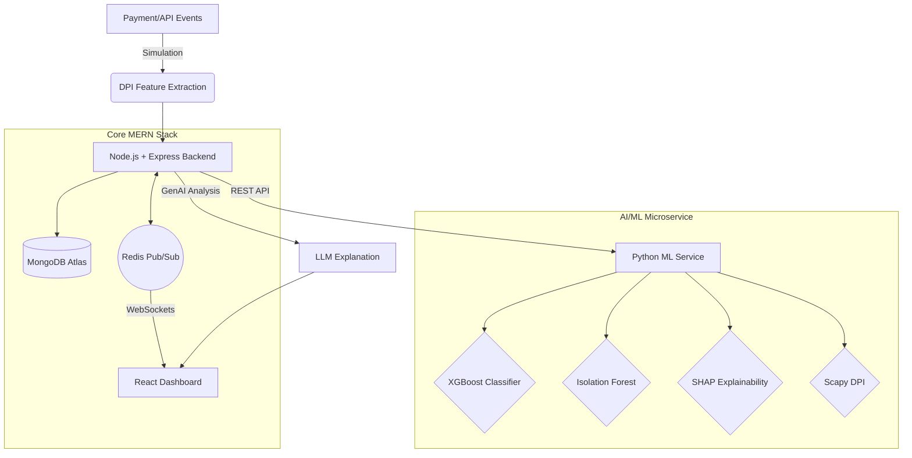

# AI Risk Manager — Real-Time Payment Security

> **A MERN-based real-time payment risk management platform with a Python machine-learning and deep packet inspection service.**

A production-quality fintech security platform designed to detect payment fraud and anomalous network patterns in real-time. This project combines rule-based systems with machine learning, deep packet inspection, and Generative AI explainability.

---

## 🎯 Problem Statement

Modern payment systems face sophisticated attacks that evade traditional rule-based engines:
- Rapid automated fraud attempts & API abuse
- Account takeover via credential stuffing
- Velocity fraud and unusual transaction spikes
- Network-level attacks (DDoS or abnormal packet sizes)

**The Solution:**
This platform orchestrates a multi-layered defense. It combines real-time **Transaction & Behavioral scoring**, **Network traffic anomaly detection**, and **Machine Learning models (XGBoost + Isolation Forest)** to generate a comprehensive risk score. The final decision is paired with **SHAP feature importance** and a **Generative AI narrative**, making complex ML models fully explainable to fraud analysts.

---

## 🏗 Architecture



---

## 🛠 Technology Stack

This project strictly utilizes a microservices approach to separate high-throughput web architecture from specialized ML computation.

- **Frontend**: React, TypeScript, Vite, Tailwind CSS, Recharts
- **Backend**: Node.js, Express, TypeScript, Zod, JWT, Helmet, express-rate-limit, Swagger/OpenAPI
- **AI/ML Service**: Python, FastAPI, XGBoost, Scikit-Learn (Isolation Forest), SHAP, Scapy
- **Database**: MongoDB Atlas (Mongoose)
- **Real-Time Engine**: Redis, WebSockets
- **CI/CD & Quality**: GitHub Actions, Jest, Pytest, ESLint, Prettier

*(Note: Docker and containerization were intentionally excluded to focus on raw application deployment and CI/CD via GitHub Actions).*

---

## 📈 Risk Scoring & ML Pipeline

The final decision engine orchestrates five distinct risk vectors into a single 0-100 score:
- **Transaction Score** (25%): Amount deviations, failed attempts.
- **Behavioral Score** (25%): Velocity, device intelligence, IP novelty.
- **Network Score** (20%): Request rates, packet sizes, DPI signals.
- **ML Anomaly (Isolation Forest)** (15%): Unsupervised detection of outlier patterns.
- **ML Supervised (XGBoost)** (15%): Binary classification trained on historical risk patterns.

**Decision Thresholds:**
- `0–30`: ✅ **ALLOW**
- `31–60`: 👁 **MONITOR**
- `61–80`: 🔐 **STEP-UP**
- `81–100`: 🚫 **BLOCK**

### Explainable AI (XAI)
A critical feature for enterprise adoption is explainability. Using **SHAP (SHapley Additive exPlanations)**, the XGBoost model outputs exact feature contributions for every transaction. An LLM (OpenAI/Gemini) then synthesizes these numerical values into a human-readable narrative.

---

## 🚀 Setup & Local Development (Windows / macOS / Linux)

### Prerequisites
- Node.js 20+
- Python 3.11+
- Redis (running locally or remote via managed service)
- MongoDB Atlas (or local MongoDB)

### Environment Configuration
Copy the `.env.example` file to `.env` in the `frontend`, `backend`, and `ml-service` directories. 
Ensure you provide a valid `MONGODB_URI`, `REDIS_URL`, and `JWT_SECRET`.

### 1. Python ML Service (Port 8001)
```bash
cd ml-service
python -m venv venv
# Windows: venv\Scripts\activate | macOS/Linux: source venv/bin/activate
pip install -r requirements.txt
uvicorn main:app --reload --port 8001
```

### 2. Node.js Backend (Port 3000)
```bash
cd backend
npm install
npm run dev
```

### 3. React Frontend (Port 5173)
```bash
cd frontend
npm install
npm run dev
```

---

## 🛡️ API Documentation & Security
The backend is fortified with industry-standard security headers (Helmet), rigorous input validation (Zod), and rate-limiting to prevent brute force attacks. 

Once the backend is running, view the complete **Swagger / OpenAPI Documentation** at:
👉 `http://localhost:3000/api-docs`

---

## 🧪 Testing & CI/CD
This project guarantees reliability via automated testing and continuous integration:
- **Backend**: Tested using `Jest` and `Supertest`. Run with `npm run test` inside the `/backend` folder.
- **Python**: Tested using `Pytest`. Run with `pytest` inside the `/ml-service` folder.
- **CI/CD**: A GitHub Actions workflow (`.github/workflows/ci.yml`) automatically lints, type-checks, and tests all code on every push or pull request to the `main` branch.

---

## 🌐 Deployment Configuration

The services are designed to be deployed independently to modern cloud providers:
- **MongoDB Atlas**: Fully managed database cluster.
- **Frontend**: Build using `npm run build`, and deploy the static `dist/` output to **Vercel** or **AWS S3**.
- **Node.js Backend**: Deployable to **Render** or **Heroku**. Binds to `$PORT`.
- **Python Service**: Deployable to **Render** or **Railway**. Use `uvicorn main:app --host 0.0.0.0 --port $PORT`.

---

## 🎙️ How to Explain This Project in an Interview

> *"I built a MERN-based real-time payment risk management platform. The Node.js and Express backend handles transactions, authentication, risk orchestration, MongoDB persistence, and real-time communication. For machine learning and deep packet inspection, I separated the specialized workloads into a Python service using XGBoost, Isolation Forest, SHAP, and Scapy. Redis is used for real-time event distribution, and the React dashboard visualizes risk decisions and explanations with premium UI/UX patterns like skeleton loading and toast notifications. The entire system is fortified with Swagger documentation, rate limiting, global error handling, and a GitHub Actions CI pipeline."*
